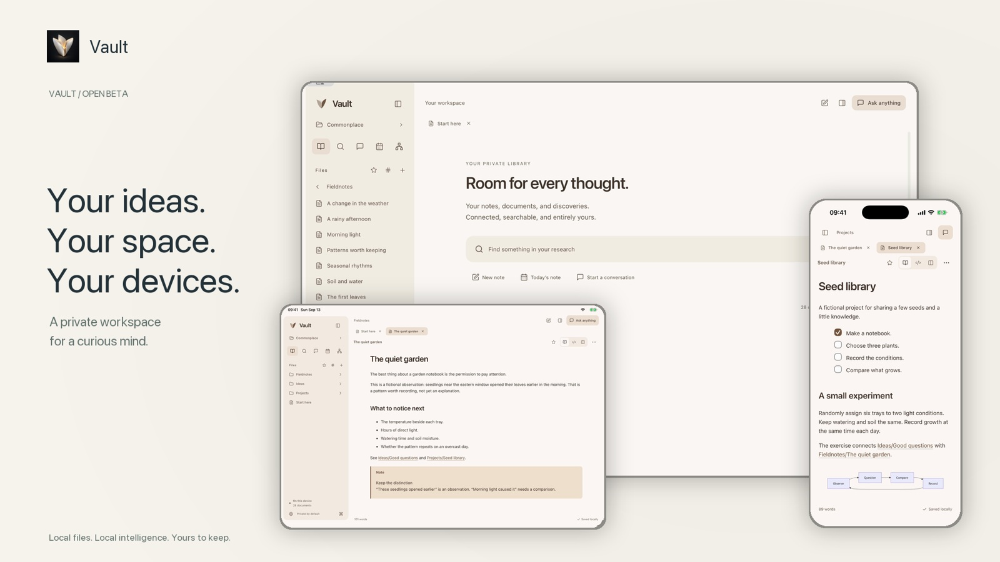

<p align="center"></p>
<h1 align="center">Vault</h1>
<p align="center"><strong>Open quickly. Think freely. Keep it yours.</strong></p>
<p align="center">Local documents · Local AI · Direct device sync<br>Mac · iPhone · iPad</p>
<p align="center"><a href="https://github.com/lbrendle/vault/releases">Download</a> · <a href="docs/GETTING_STARTED.md">Get started</a> · <a href="docs/BUILDING.md">Build it yourself</a> · <a href="docs/COMPATIBILITY.md">What works today</a></p>

Vault is a private document workspace built around ordinary folders. Open your existing Markdown vault, read PDFs, follow connections, and talk with a model running on your own hardware. Keep the folder on your drive. Take a backup with you. Your research does not need a hosted workspace.

**Public beta: `0.5.0-beta.1`.** Read the [document and device support notes](docs/COMPATIBILITY.md) before moving a critical workflow.

[](https://github.com/lbrendle/vault/releases/download/v0.5.0-beta.1/vault-demo-1080p.mp4)

<p align="center">A short tour of the real app. Fictional library; mobile footage recorded in iOS Simulator.</p>

## Less waiting. More room to think.

**Get into your documents quickly.** Long notes open progressively, and the PDF reader renders nearby pages as you scroll. Keep reading without building the entire document on screen first.

**Sync what changed.** Direct device connections send changed files, batch small documents, and resume interrupted transfers. Once a file arrives, it is available offline. Initial setup for a large library takes longer than later updates.

**Keep your library focused.** Search and indexing work locally. Development folders stay out of the document library, while your files remain in the folder you chose.

**Bring your own intelligence.** Two Qwen starters, folder-based model imports, and native on-device inference let you choose a companion for your hardware. Your documents and conversations do not need a hosted AI service.

## A workspace that stays out of the way

- Read and edit Markdown, with linked notes, backlinks, tabs, source/split views, math, diagrams, callouts, footnotes, and document history.
- Read multi-page PDFs with a continuous, virtualized reader and a compact toolbar.
- Search locally with SQLite full-text search. Development folders such as `.git` and `node_modules` stay on disk and out of your library.
- Explore your entire link graph with pan, pinch/zoom, search, clustering, and detail that adapts to zoom.
- Choose from **24 palettes in light and dark**, with matching icons, smooth collapsing sidebars, and a dedicated settings page.
- Keep conversations beside your research. Attach documents, cite local paths, stop a response, or branch a conversation.
- Sync documents, attachments, saved conversations, and bookmarks directly between paired devices. Synced files remain available offline.

## Two Qwen companions, ready to use

The native MLX inference engine is included on all three platforms. No Python runtime, hosted API, account, or API key is needed.

| Starter | Download size | Best starting point |
| --- | --- | --- |
| **Qwen 3.5 · 2B · 4-bit** | 1.75 GB | The smaller everyday companion; start here on mobile |
| **Qwen 3.5 · 4B · 4-bit** | 3.06 GB | More capable reasoning, with more memory required |

The **Mac Starter** download includes the 2B model inside the app and can answer offline on first launch. The lightweight Mac download and iOS source builds offer both models in **Settings → Models & chat**. Choose **Install smaller Qwen** or **Install larger Qwen** once; subsequent conversations run offline. The larger model is an optional download, not embedded in the Git repository.

Downloads come from pinned Hugging Face revisions, resume after interruption, and validate every file with SHA-256 before installation. Both model distributions retain their **Apache-2.0** licenses and attribution. Weights are excluded from source control so clones and contributions remain practical. [Model details and offline import](models/README.md).

Already have a model? Import a complete supported MLX model folder from Finder, Files, or a USB drive. GGUF files and Ollama/LM Studio servers are not yet supported by this beta. Different checkpoints need different amounts of working memory; storage size is not a RAM requirement.

## Private by design

There is no Vault cloud account, hosted sync service, analytics endpoint, or hosted inference service. Your files stay in the folder you choose. Model downloads contact Hugging Face only when you request them. External links open in your browser. The app blocks remote document media by default. Read the [privacy policy](docs/PRIVACY.md).

Device sync uses an authenticated, encrypted direct connection on your local network. **Sync is bidirectional**, including edits made by another app in the same folder. Concurrent changes preserve a conflict copy. iOS can suspend background work: keep Vault open on both devices during the first transfer. This is not an internet relay or a background-sync guarantee. [Sync and privacy](docs/SYNC.md).

## Install or build

Get the latest [release](https://github.com/lbrendle/vault/releases). Mac downloads target **Apple silicon, macOS 14+**. Release notes describe signing/notarization status; this beta is not distributed through the App Store.

For iPhone/iPad, build with Xcode and your own signing team. The deployment target is iOS/iPadOS 17; actual model compatibility depends on hardware and available memory. There is no generally installable iOS IPA or TestFlight invitation in this release.

```sh
git clone https://github.com/lbrendle/vault.git
cd vault
npm ci --prefix web
npm run build --prefix web
xcodegen generate --spec native/project.yml
open native/ArchiiVault.xcodeproj
```

Choose `ArchiiVaultMac` for Mac or `ArchiiVault` for iPhone/iPad. Use **Xcode 26.6+** with its Metal toolchain, **Node 22+**, and **XcodeGen**. See the [build guide](docs/BUILDING.md) for CLI builds, signing, device model installation, and tests.

## Contribute

Issues, focused pull requests, and reproducible synthetic examples are welcome. Read [CONTRIBUTING.md](CONTRIBUTING.md), the [roadmap](docs/ROADMAP.md), and the [security policy](SECURITY.md). Please do not attach your private research vault, conversations, pairing codes, or device provisioning profiles to public issues.

Licensed under **Apache-2.0**. Dependencies and model weights retain their own licenses; see [third-party notices](docs/THIRD_PARTY.md). Vault is an independent project, not affiliated with OpenAI, Qwen, or Apple.
