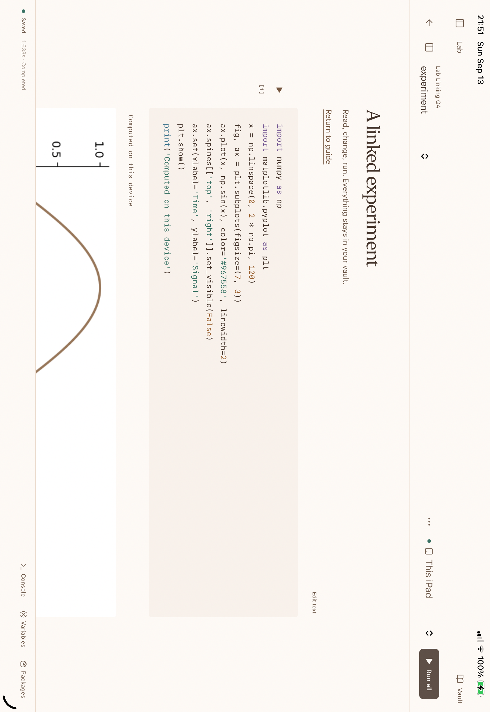
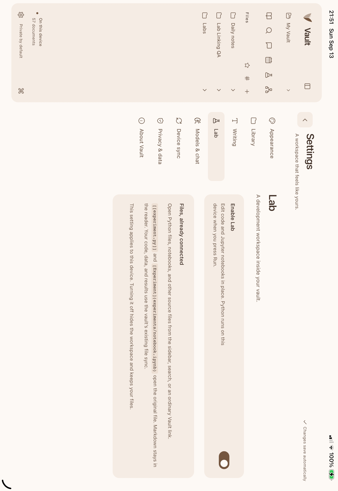

# Lab in Vault

Lab is an optional workspace in the existing Vault app for Mac, iPhone, and iPad. Enable **Settings → Lab → Enable Lab** on each device. It is off by default. Markdown remains in the reader. Python and notebook execution starts only when you press Run; following a link never executes code.

## One folder, ordinary links

Open a code file from the sidebar, search, a Markdown link, or a wikilink:

```markdown
[[baseline.py]]
[Experiment](experiments/model.ipynb)
```

Lab edits the original file in its existing folder. It does not import a duplicate or convert a Markdown lesson into executable code. Files alongside the script or notebook are available to the project. New projects live in `Labs/`.

Notebook Markdown supports the same links back to notes. Notebook Markdown cells are indexed for search and backlinks; the notebook options menu includes **Linked notes**. Explicit extensions distinguish `baseline.py` from `baseline.md`.

The same document and device-sync system carries source files, notebooks, outputs, and datasets. Live interpreter variables are not synchronized. A clean open file checks for external updates while Lab is visible; revision checks reject stale saves. Development dependencies and caches are excluded from the file browser. Original documents and code remain ordinary files usable in other editors.

Turning Lab off hides the workspace and preserves its files. The web workspace loads lazily; Python initializes on first use. The iOS app currently bundles its Python libraries, so the toggle does not reduce download size. An initialized iOS interpreter can remain resident until the app closes.

## Workspace

The notebook has one primary toolbar. Its file chooser keeps navigation close; the project file tree opens when needed. Cell actions appear on the selected cell. Console, variables, packages, notebook source, and session controls remain available without filling the reading area.

- Edit `.ipynb` notebooks and Python source, with code completion, syntax highlighting, undo, and keyboard shortcuts.
- Execute cells or scripts, inspect variables, display tables and plots, and save ordinary notebook outputs.
- Use `python script.py [arguments]`, `pytest`, and the supported Git commands in the console.
- Install pure Python wheels with `pip install`. Native extensions need compatible, signed iOS builds; an arbitrary desktop wheel cannot be installed on iOS.
- Edit other source and configuration formats in the same workspace. The executable runtime in this version is Python, with explicit native GPU bridges; it does not compile arbitrary Swift, Rust, C++, or JavaScript projects.

The console is an embedded development console, not a complete Unix shell. Pipes, shell processes, Python `-m`/`-c`, general subprocesses on iOS, LSP debugging, and a Jupyter server/protocol implementation are not included. The notebook file format is standard Jupyter; the interface and execution bridge are Vault's.

## On-device runtime

The iOS build embeds CPython 3.12.14 and pinned iOS-compatible NumPy, pandas, Matplotlib, Pillow, SymPy, NetworkX, pytest, and Dulwich libraries. The dependency lock records exact downloads and SHA-256 values. No Mac or internet connection is required to run the bundled examples after installation.

`vaultlab.metal` exposes a deliberately small, inspectable tensor/gradient bridge to native MLX and a raw Metal source-kernel interface. Both execute on the device GPU. This is not the full Python `mlx` or `torch` API. Python tracing can stop or time-limit Python code; it cannot preempt a long-running native C/GPU call. Runs should remain in the foreground.

## Mac environment and optional LAN host

Mac uses a local Python process. Prepare an environment with Python 3.12:

```sh
bash scripts/setup-mac-lab.sh /path/to/lab-env /path/to/python3.12
```

Set that environment's `bin/python` in **Lab → Mac host settings**. Local Mac execution does not require enabling remote hosting. Allow paired devices only if you want to run iPad/iPhone jobs on that Mac. Pair the vault through the existing Device sync settings; keep both devices on the same local network and the apps open. A private local address can be entered if Bonjour discovery is unavailable. Authentication uses the vault pairing key, and supporting files must match before remote execution.

The installer uses `native/lab-mac-requirements.lock.txt`, including transitive package versions. Mac Python runs with the app's filesystem access; its project directory is a working directory, not a security sandbox.

The Mac worker has been tested with SciPy, scikit-learn, and real subprocesses. End-to-end paired-Mac lab execution has not passed the current physical-device LAN acceptance check. It must not be treated as a verified fallback for unsupported iOS packages yet.

## Advanced lab coverage

The embedded environment supports substantial programming, mathematics, data analysis, plotting, and small native GPU experiments. It does not yet cover every package or operating-system requirement in an advanced scientific curriculum.

| Requirement | Current status |
| --- | --- |
| NumPy/pandas/Matplotlib, SymPy, NetworkX, SQLite, pytest, local Git | Bundled and exercised on a physical iPad |
| Small native MLX gradient training and checkpoints | Exercised on a physical iPad through Vault's explicit bridge |
| Editable Metal source kernels | Compiled and executed on a physical iPad |
| Full Python PyTorch MPS / MLX package APIs | Not provided by the iOS bridge |
| SciPy and dependent neuro/probabilistic packages | Not bundled on iOS; package-specific work remains |
| Fresh-process reproduction, actual crash/process isolation, CPU multiprocessing | iOS embedded kernel does not satisfy these requirements |
| Arbitrary Unix toolchains or CUDA/Triton | Not supplied by this iOS environment |

See the [Lab validation entry](VALIDATION.md#optional-lab-development-candidate--september-13-2026) for the distinction between compilation, Simulator checks, physical-device execution, and paired-host testing.

## Screenshots

These captures use a fictional guide and experiment. The iPad screenshot is from physical hardware; the iPhone screenshot is from Apple's Simulator.






