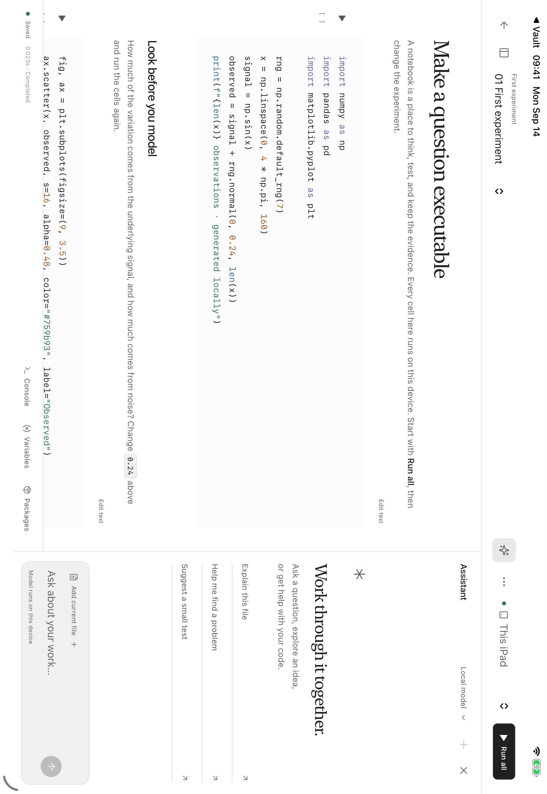
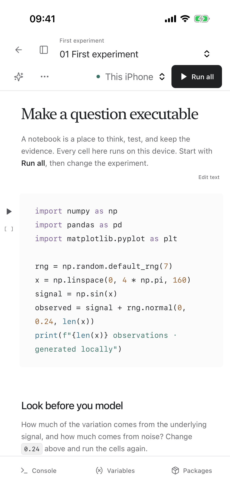

# Lab in Vault

Lab is an optional workspace in the existing Vault app for Mac, iPhone, and iPad. Enable **Settings → Lab → Enable Lab** on each device. It is off by default. Markdown remains in the reader. Python and notebook execution starts only when you press Run; following a link never executes code. Bare filenames such as `baseline.py` and inline code paths are local references; explicit web URLs still open in a browser. A file must exist in this device’s vault to open it. Newly received code can open before indexing finishes.

Python files, Jupyter notebooks (`.ipynb`), and other supported source files are discovered in any folder selected as a vault, even with Lab off. Older saved file rules are upgraded once; excluded directories and paths are preserved. Returning to Vault refreshes the folder browser for files added in another app.

## One folder, ordinary links

Open a code file from the sidebar, search, a Markdown link, or a wikilink:

```markdown
[[baseline.py]]
[Experiment](experiments/model.ipynb)
```

Lab edits the original file in its existing folder. It does not import a duplicate or convert a Markdown lesson into executable code. Files alongside the script or notebook are available to the project. New projects live in `Labs/`.

Notebook Markdown supports the same links back to notes. Notebook Markdown cells are indexed for search and backlinks; the notebook options menu includes **Linked notes**. Explicit extensions distinguish `baseline.py` from `baseline.md`.

The same document and device-sync system carries source files, notebooks, outputs, and datasets. Live interpreter variables are not synchronized. A clean open file checks for external updates while Lab is visible; revision checks reject stale saves. Development dependencies and caches are excluded from the file browser. Original documents and code remain ordinary files usable in other editors.

Turning Lab off hides the workspace and preserves its files. The web workspace loads lazily; Python initializes on first use. The iOS app currently bundles its Python libraries, so the toggle does not reduce download size. An initialized iOS interpreter can remain resident until the app closes.

## Workspace

The notebook has one primary toolbar. The searchable file tree groups files by folder and keeps run history in a separate section. Console, Variables, and Packages have labeled tabs; expand a tool to use the available workspace, then shrink or close it to return to the notebook. On phones, files and the assistant open as full-width panes. The console expands while its software keyboard is open. Cell actions appear on the selected cell.

- Edit `.ipynb` notebooks and Python source, with code completion, syntax highlighting, undo, and keyboard shortcuts.
- Execute cells or scripts, inspect variables, display tables and plots, and save ordinary notebook outputs.
- Use `python script.py [arguments]`, `pytest`, and the supported Git commands in the console.
- Install pure Python wheels with `pip install`. Native extensions need compatible, signed iOS builds; an arbitrary desktop wheel cannot be installed on iOS.
- Edit other source and configuration formats in the same workspace. The executable runtime in this version is Python, with explicit native GPU bridges; it does not compile arbitrary Swift, Rust, C++, or JavaScript projects.

The console is an embedded development console, not a complete Unix shell. Pipes, shell processes, Python `-m`/`-c`, general subprocesses on iOS, LSP debugging, and a Jupyter server/protocol implementation are not included. The notebook file format is standard Jupyter; the interface and execution bridge are Vault's.

## Installing Python packages

Use `pip install ipython` in the console, or run a notebook cell such as:

```python
%pip install ipython
from IPython.display import HTML
HTML("<b>Hello from Vault</b>")
```

`!pip install` also works. Packages and downloaded-wheel caches live inside the project's `.vaultlab` folder. Already available compatible packages are reused; `--upgrade` requests an update. `-r requirements.txt` accepts named packages and version constraints from a file inside the project. Direct install scripts and arbitrary installer flags are not supported.

Package commands receive a five-minute default run budget, a 60-second download timeout, and one recovery attempt after an interrupted wheel download. Completed downloads are cached. Network failures report a network error; missing compatible wheels report a package compatibility error. Detailed installer output and tracebacks remain available behind disclosure controls and in run records. Internet access is needed to download new packages, but installed packages run locally.

## On-device runtime

The iOS build embeds CPython 3.12.14 and pinned iOS-compatible NumPy, pandas, Matplotlib, Pillow, SymPy, NetworkX, pytest, and Dulwich libraries. The dependency lock records exact downloads and SHA-256 values. No Mac or internet connection is required to run the bundled examples after installation.

`vaultlab.metal` exposes a deliberately small, inspectable tensor/gradient bridge to native MLX and a raw Metal source-kernel interface. Both execute on the device GPU. This is not the full Python `mlx` or `torch` API. Python tracing can stop or time-limit Python code; it cannot preempt a long-running native C/GPU call. Runs should remain in the foreground.

## Mac environment and optional LAN or Tailscale host

Mac uses a local Python process. Prepare an environment with Python 3.12:

```sh
bash scripts/setup-mac-lab.sh /path/to/lab-env /path/to/python3.12
```

Set that environment's `bin/python` in **Lab → Mac host settings**. Local Mac execution does not require enabling remote hosting. Allow paired devices only if you want to run iPad/iPhone jobs on that Mac. Pair the vault through the existing Device sync settings; keep the apps open. Use Bonjour on the same LAN, or enter the Mac’s Tailscale 100.x address or full .ts.net name and the port shown in Mac host settings. Both devices must be connected to the same tailnet for Tailscale. An authenticated direct connection is remembered per vault and also participates in file sync. Authentication uses the vault pairing key, and supporting files must match before remote execution.

The installer uses `native/lab-mac-requirements.lock.txt`, including transitive package versions. Mac Python runs with the app's filesystem access; its project directory is a working directory, not a security sandbox.

The Mac worker has been tested with SciPy, scikit-learn, and real subprocesses. End-to-end paired-Mac lab execution has not passed the current physical-device LAN acceptance check. It must not be treated as a verified fallback for unsupported iOS packages yet.

## Installed local models in notebooks

The same model library used by Vault chat is available in Python:

```python
from vaultlab import models
print(models.list())
answer = models.generate("Explain a confidence interval", max_tokens=128)
print(answer)
```

`models.chat([{"role": "user", "content": "Your question"}])` returns text and local execution metadata. Choose `model="installed-folder-name"` or omit it to use Vault's selected installed model. Models are installed separately through **Settings → Models & chat**; calling them from a cell never downloads weights or contacts a server. The existing memory checks apply, generation unloads the model afterward, and local AI and Lab GPU work share an admission gate. A notebook running on a paired Mac uses that Mac's installed models.

## Optional coding assistants

Open **Assistant** in the notebook toolbar. Its settings control contains the provider, execution target, and installed-model chooser. The assistant has its own execution target: choosing a Mac assistant does not move notebook execution off the device. Attach the current file explicitly with **Add current file**; notebook attachments contain source cells, not saved outputs. Follow-up context is bounded and separated by project, provider, and target.

The default is Vault's local model. Codex and Claude Code run through an installed CLI on the Mac using its existing login; on iPad/iPhone choose the paired Mac target first. They are optional integrations and are not distributed as part of Vault. Local Python, notebooks, and local models remain usable without these services.

Connected assistants can send prompts and project context to their provider and use the account's quota. File edits are off by default. Codex uses its read-only or workspace-write sandbox; Claude Code is restricted to read tools or, when editing is enabled, file editing tools. This integration does not embed their full interactive terminal UI. No permission-bypass flags are used. Their outputs appear in the Assistant panel and project run records; modified files use the existing vault sync and revision checks.

```python
# Mac target only. These calls use the provider, not the on-device model.
from vaultlab import agents
print(agents.available())
# Run explicitly when you want an online assistant:
# print(agents.run("codex", "Explain baseline.py"))
# print(agents.run("claude", "Add a test for baseline.py", edit=True))
```

Console equivalents are `codex "Explain baseline.py"`, `claude "Explain baseline.py"`, and the `cc` alias. Vault checks standard CLI locations; for Codex it prefers the CLI bundled in an installed Codex/ChatGPT Mac app to stay compatible with that app's models. Credentials are not copied into the vault. See [Codex non-interactive mode](https://developers.openai.com/codex/noninteractive), [Claude Code programmatic usage](https://code.claude.com/docs/en/headless), and [Tailscale addresses](https://tailscale.com/docs/concepts/tailscale-ip-addresses).

### Can npm install these assistants on iPhone or iPad?

Current Codex and Claude Code npm packages deliver native desktop executables; neither publishes an iOS target. Embedding Node.js alone does not make those executables runnable. Node.js Mobile also documents restrictions on spawning processes and loading native modules. Vault does not offer a nonfunctional on-device npm installer. A future embedded port would need its own compatible runtime and tool execution implementation; no working port is claimed here. See the official [Codex CLI](https://developers.openai.com/codex/cli/), [Claude Code npm installation](https://code.claude.com/docs/en/setup#install-with-npm), and [Node.js Mobile FAQ](https://github.com/nodejs-mobile/nodejs-mobile/blob/main/doc_mobile/FAQ.md).

## Advanced lab coverage

The embedded environment supports substantial programming, mathematics, data analysis, plotting, and small native GPU experiments. It does not yet cover every package or operating-system requirement in an advanced scientific curriculum.

| Requirement | Current status |
| --- | --- |
| NumPy/pandas/Matplotlib, SymPy, NetworkX, SQLite, pytest, local Git | Bundled and exercised on physical iPad and iPhone |
| Small native MLX gradient training and checkpoints | Exercised on a physical iPad through Vault's explicit bridge |
| Editable Metal source kernels | Compiled and executed on a physical iPad |
| Full Python PyTorch MPS / MLX package APIs | Not provided by the iOS bridge |
| SciPy and dependent neuro/probabilistic packages | Not bundled on iOS; package-specific work remains |
| Fresh-process reproduction, actual crash/process isolation, CPU multiprocessing | iOS embedded kernel does not satisfy these requirements |
| Arbitrary Unix toolchains or CUDA/Triton | Not supplied by this iOS environment |

See the [Lab validation entry](VALIDATION.md#optional-lab--build-28-september-14-2026) for the distinction between compilation, Simulator checks, physical-device execution, and paired-host testing.

## Screenshots

The current workspace captures below use fictional experiments in Apple's iPhone and iPad Simulators. Physical-device execution and earlier layout checks are recorded separately in [VALIDATION.md](VALIDATION.md).




