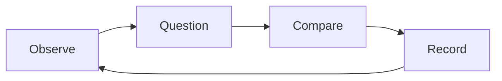

# Seed library

A fictional project for sharing a few seeds and a little knowledge.

- [x] Make a notebook.
- [ ] Choose three plants.
- [ ] Record the conditions.
- [ ] Compare what grows.

## A small experiment

Randomly assign six trays to two light conditions. Keep watering and soil the same. Record growth at the same time each day.

The exercise connects [[Ideas/Good questions]] with [[Fieldnotes/The quiet garden]].

